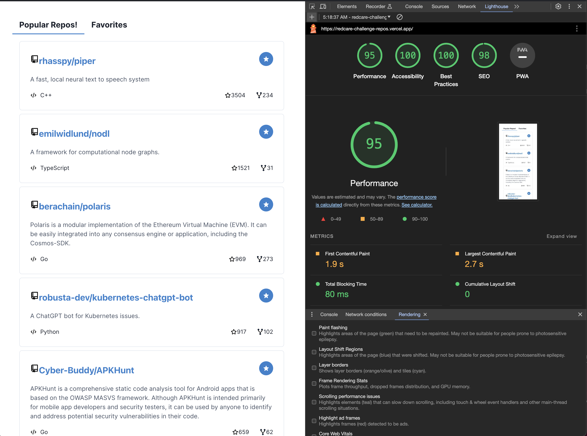

## Architecture

This challenge is designed based on a clean, hexagonal architecture, it does not follow a strict folder pattern, please review the following folder approach: 
* `app`: this folder contains the main config and all the pages and orchestration layouts.
* `services`: contains all the artifacts for API communication.
* `hooks`: custom hooks for application/domain layer.
* `components` & `screens`: ui layer.

## Technicall Decisions
### State managements
this challenge implements React Query as a query handler and state manager, taking advantage of the cache features and Queries/Mutations for a simple global state
### SSR
This is a project based on NextJs v. 14
### UI lib
Chakra ui is used as a ui framework to develop react components
### API
This projects gets repositories data from github api, following next [Documentation](https://docs.github.com/en/rest/using-the-rest-api/using-pagination-in-the-rest-api?apiVersion=2022-11-28)
 for pagination and query params  


## Trade-offs
This challenge is more focused on performance and functionality, that's why you can find a SSR config and a paginated service (using React Query infiniteQuery).



however the following is a description of those tasks that remain to be completed:
 * `Testing`: Implement unit test for RepoCard component, repo service and custom hooks. I'd add E2E testing for and entire flow. 
 * `UI patterns`: using a unique style patterns instead of the combination of css modules and chakra ui.
 * `HTML`: use a better html structure, for example use table tags for the repo list.
 * `Persist cache`: add and implementation to persist favorites repos.
 * `Handle errors`: add a better management of errors, for example a ErrorBoundaries comp.
 * `Filters`: add more filters using the query params of github API.

### Installation
Clone this repository.

```sh
$ cd redcare-challenge
$ yarn
$ yarn dev
```
-Open  http://localhost:3000

## Live Demo

https://redcare-challenge-repos.vercel.app/


